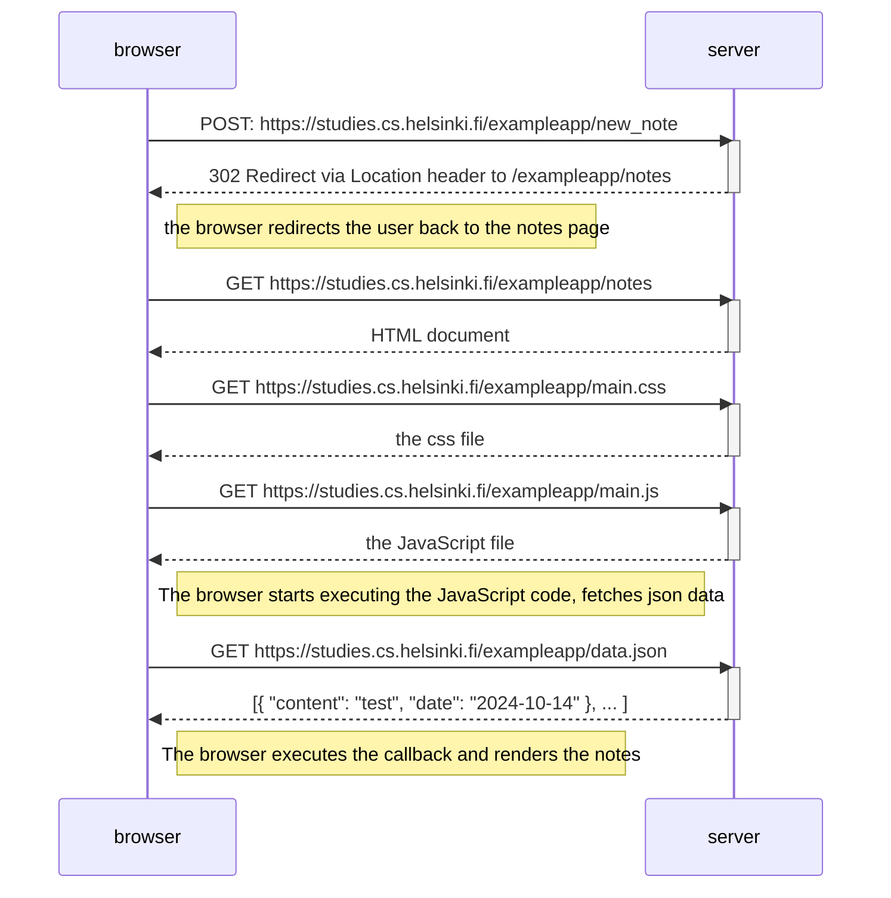

```mermaid
sequenceDiagram
    participant browser
    participant server

    browser->>server: POST: https://studies.cs.helsinki.fi/exampleapp/new_note
    activate server
    server-->> browser: 302 Redirect via Location header to /exampleapp/notes
    deactivate server
    note right of browser: the browser redirects the user back to the notes page
    

    browser->>server: GET https://studies.cs.helsinki.fi/exampleapp/notes
    activate server
    server-->>browser: HTML document
    deactivate server

    browser->>server: GET https://studies.cs.helsinki.fi/exampleapp/main.css
    activate server
    server-->>browser: the css file
    deactivate server

    browser->>server: GET https://studies.cs.helsinki.fi/exampleapp/main.js
    activate server
    server-->>browser: the JavaScript file
    deactivate server
    note right of browser: The browser starts executing the JavaScript code, fetches json data

    browser->>server: GET https://studies.cs.helsinki.fi/exampleapp/data.json
    activate server
    server-->>browser: [{ "content": "test", "date": "2024-10-14" }, ... ]
    deactivate server
    note right of browser: The browser executes the callback and renders the notes

```